### Полный конспект философии и функций AOo (Apache OpenOffice):

1. **Единое ядро AOo**:
   - Программа представляет собой не набор отдельных приложений, а цельную систему с одним ядром, что позволяет создавать и открывать любой документ из одного интерфейса. Это экономит место и делает интерфейс более интуитивным.

2. **Объектная модель**:
   - Все элементы документа (текст, таблицы, рисунки) считаются объектами, которые можно редактировать и настраивать. Объекты могут иметь «родителей» и «потомков», а их свойства наследуются. Взаимодействие с объектами строится через метаобъекты (например, графики, таблицы и изображения с подписями) для удобства управления.

3. **Логическое построение интерфейса**:
   - Меню и панели AOo упрощены и сгруппированы по типам задач: «Правка», «Вставка», «Формат» и т.д. Области документа доступны для редактирования без дополнительных настроек, с динамическими панелями, которые автоматически появляются при выделении таблиц, списков и других объектов.

4. **Автоматизация и разделение документов по доступу**:
   - AOo поддерживает создание **редактируемых** и **нередактируемых** документов:
     - *Нередактируемые* — например, экспорт в PDF.
     - *Редактируемые* делятся на три типа: свободно редактируемые, частично редактируемые (с защитой отдельных частей) и с ограниченным доступом (с паролем). Режимы защиты от изменений включают "Только для чтения", где все изменения фиксируются, особенно удобно для договоров.

5. **Концепция стилей и шаблонов**:
   - Стили управляют форматированием всего документа (заголовков, абзацев, списков), упрощая изменение формата. Для унификации используются шаблоны, что повышает производительность, обеспечивая стандартизацию оформления документов.
   - Шаблоны позволяют быстро создавать повторяющиеся типы документов (договоры, отчеты) и поддерживать стандарты. Система репозиториев AOo позволяет централизованно обновлять шаблоны для всех сотрудников.

6. **Защита и контроль доступа**:
   - AOo предлагает криптографическую защиту документов с паролями и шифрованием, что делает его пригодным для работы с конфиденциальной информацией. Шифрование осуществляется на уровне ядра, и защищенные файлы представляют собой зашифрованные zip-архивы.

7. **Наследование и метаобъекты**:
   - Все объекты в AOo наследуют свои свойства от родительских объектов. Например, изменение базового стиля цвета автоматически отразится на всех элементах, кроме тех, где определены индивидуальные настройки.

8. **Динамические панели и адаптивный интерфейс**:
   - AOo автоматически подстраивает интерфейс под текущие действия: плавающие панели для таблиц, списков и других контекстов появляются по мере необходимости, что делает работу интуитивной.

### Принципы работы с AOo:

1. *«Клерк не изобретатель»*: В AOo работа с документами осуществляется через шаблоны и стили, избегая ручного редактирования.
2. *Репозиторий шаблонов* позволяет поддерживать единообразие в документации и оперативно обновлять шаблоны по всей организации.

Эти особенности делают AOo мощным инструментом для корпоративного документооборота, ориентированного на стандартизацию, защиту данных и автоматизацию.

     

## Концепция стилей

### Что такое стили?

Стиль – это набор форматов, применяемый к выбранным страницам, тексту, врезкам и другим элементам документа для быстрого изменения их вида.

AOo поддерживает следующие классы стилей:

- Стили страницы относятся к полям, колонтитулам, границам и фону. В электронных таблицах Calc стили страниц также относятся к последовательности печати страниц.

- Стили абзаца управляют всеми аспектами вида абзацев, такими как отступы текста, табуляция, межстрочное расстояние, границы, включая форматирование символов.

- Стили символа влияют на текст внутри абзаца, определяя шрифт, его размер, форматы начертания — жирный, курсив и т. п.

- Стили врезок используются для форматирования графических и текстовых врезок, включая переходы на новую строку, границы, фон и полосы.

- Стили списка определяют выравнивание, тип нумерации или маркеров, и шрифты для нумерованных и ненумерованных списков.

- Стили ячейки относятся к шрифтам, выравниванию, границам, фону, форматам чисел (например, валюта, дата, номер) и защите ячеек.

- Стили графики на рисунках и в презентациях относятся к линиям, областям, теням, прозрачности, шрифту, соединителям, размерам и другим атрибутам.

- Стили презентации определяют атрибуты шрифта, отступов, расстояний, выравнивания и табуляции.

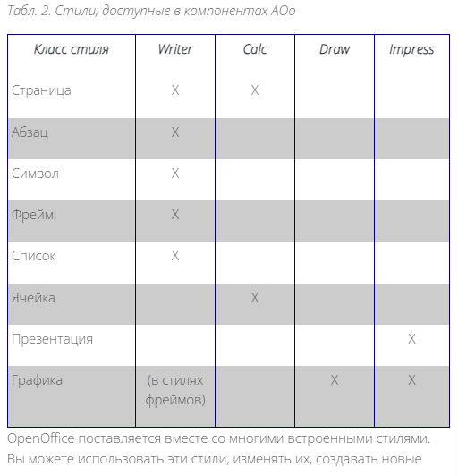

### Зачем использовать стили?

 Главная ошибка, которую допускают пользователи, — это форматирование вручную абзацев, слов, таблиц, размещения текста на странице и других частей документов без использования стилей. Они создают документы, используя физические атрибуты. Например, изменяют разные шрифты и их размер, а также выделение текста жирным или курсивным начертанием и т. д.

 И в этом вторая ошибка пользователей — создание оформления вместо создания структуры. При подготовке документа главное это то, чем текст является. А как он выглядит — вторично.

 При подготовке текста следует перестать пользоваться такими категориями, как «размер шрифта 14pt», «гарнитура Times New Roman», «начертание полужирное», «расположение по центру» и т. д. Необходимо перестроить своё мышление на использование категорий «Заголовок», «Заголовок первого уровня», «Заголовок второго уровня», «Заголовок n-ого уровня», «основной текст», «маркированный список», «нумерованный список», «нижний колонтитул», «верхний колонтитул», и т. д.

 Таким образом, создание нового документа начинается не с сочинения первого абзаца, а с продумывания структуры документа и создания под эту структуру системы стилей, выражающих данную структуру. При этом, как будет выглядеть конечный документ, (шрифты, гарнитура, и т. д.) решается в последний момент, когда документ уже готов, путём изменения соответствующего стиля.

### Предназначение различных типов стилей. Стили страницы Writer.

Настольные издательские системы это средство для подготовки и создания образца печатной продукции готового для тиражирования.

Исходя из этого — главной функцией издательской системы являются строгое управление страницами и ювелирная точность в расположении элементов на странице. Следовательно, базовым понятием и объектом является страница. Текст же может отсутствовать вообще.

Таким образом, главная функция текстового процессора — набор и форматирование текста. Следовательно, базовое понятие и объект — это абзац. В текстовом процессоре отсутствует объект «страница». Форматирование листа применяется от одной явной метки до другой (либо до конца документа).

Страницы в текстовых процессорах являются виртуальными объектами, вычисляемыми динамически в зависимости от расположения текста. Если нет текста, то нет и страницы. Таким образом, чтобы создать страницу, необходимо расположить на ней хотя бы один, даже пустой, абзац текста. Следовательно, абзац первичен, страница вторична.

## Стили страницы Calc

Есть три основных отличия:

- колонтитулы
- управление
- лист

Для работы с ними предназначен специальный режим, вызываемый через меню Правка — Верхние и нижние колонтитулы.

Стиль применяется ко всему листу таблицы, не зависимо от того, на сколько страниц он будет разбит при печати. Такая организация работы влияет и на управление стилем. На соответствующей вкладке, в отличии от управлением стилем страницы в Writer'е, нельзя назначить стиль для следующей страницы.

В настройках стиля страницы присутствует вкладка «Лист». Именно здесь настраиваются главные параметры печати электронной таблицы:

- в каком порядке будет распечатан лист — колонками или строками;

- нумерация страниц — сквозная для всех листов, или индивидуальная для каждого листа (начинается с 1);

- масштаб — на скольких печатных страницах уместить лист таблицы.

## Стили абзаца

#### Положение на странице
Здесь устанавливаются разрывы страниц и настраивается связь со стилями страниц. Если указан разрыв, но не указан стиль страницы, то это означает, что к следующей (начатой с абзаца, отформатированного данным стилем) странице будет применён стиль предыдущей страницы.

#### Шрифт
Здесь, кроме прочего, устанавливается язык текста для абзацев, отформатированных данным стилем. Если язык не установлен, то проверка орфографии и грамматики для абзацев с этим стилем выполняться не будет.

#### Структура и нумерация
Здесь устанавливается связь со стилями списков. Существует много документов, в которых все абзацы и заголовки должны иметь сквозную многоуровневую нумерацию. Это, в частности, договора, нормативные акты и т. д. С помощью опций стиля абзаца создание подобных документов становится элементарным.

#### Буквица
Здесь создаётся связь со стилем символов для создания буквиц.

###  Стили списка
Данный тип стиля есть только в Writer'е. 

Используется совместно со стилем абзаца. Мощный инструмент в арсенале AOo. В пределах одного стиля списка организуется сквозная нумерация.

### Стили символа
Данный тип стиля есть только в Writer'е.

Используется совместно со стилем абзаца. Отвечает за отображение конкретного символа в тексте. Имеет несколько общих со стилем абзаца параметров — атрибуты шрифта и язык символов. Данные атрибуты имеют преимущество над установками стиля абзаца.

### Стили врезки
Данный тип стиля есть только в Writer'е.

Управляет расположением врезок на странице, их фоном, способом привязки и обтекания.

### Стиль ячейки
Данный тип стиля есть только в Calc'е.

Как и стиль абзаца для Writer'а, так для Calc'а этот тип стиля является основным — как в текстовом документе абзац является основой документа, так и ячейка является основой электронной таблицы. Стиль ячейки управляет всеми её параметрами, в том числе — форматом содержимого — числа, текст, дата и т. д.; атрибутами шрифта и цвета, обрамлением и т. п.

## Стиль презентации 

Данный тип стилей отвечает за организацию логической структуры презентации. Для этого есть предустановленные стили:

- Заголовка
- Подзаголовка
- Примечания
- Фона
- Объекта фона
- Структура 1-9

## Стили абзаца «Базовый» и «Заголовок»

Стилей «Базовый» и «Заголовок» не должно быть в документе!

Это не значит, что данные стили следует удалять из Стилиста (да это и невозможно). Это значит, что их нельзя использовать в документе.

Ситуация осложняется тем, что по умолчанию стиль «Базовый» предлагается сразу при создании нового документа. Это, к сожалению пока не исправленный недочёт начальных настроек AOo.

Рассмотрим ситуацию, в какую попадают практически все начинающие пользователи AOo — создание документа, в котором заголовок является не первым абзацем, а одним из последующих.

-------
## Стили (продолжение)

В AOo нет документов «без стилей». А посему стиль «Базовый» никогда не предназначался для создания документов с ручным форматированием. Если бы это было так, то этот стиль не лежал бы в основе всей системы стилей.

Стиль «Базовый» является родительским для всей системы стилей. От него наследуют все стили в системе. Следовательно, любые изменения в параметрах стиля «Базовый» неминуемо отражаются на всех остальных стилях. То же, но в меньшей степени, относится к стилю «Заголовок». На нём основано всё подмножество стилей, отвечающих за заголовки.

Следовательно, для основного текста необходимо применять стиль «Основной текст». Для заголовков соответствующего уровня — стиль «Заголовок 1», «Заголовок 2», «Заголовок N».

## Предназначение стандартных стилей

Первая группа — стили, который требуются для обеспечения функционала офисного пакета. Они автоматически применяются для форматирования создаваемых пользователем объектов, таких как указатели, таблицы, врезки, подписи и т. д.

Вторая группа — стили, применять которые должен сам пользователь. Они используются для создания логической структуры документа и оформления его основных разделов.

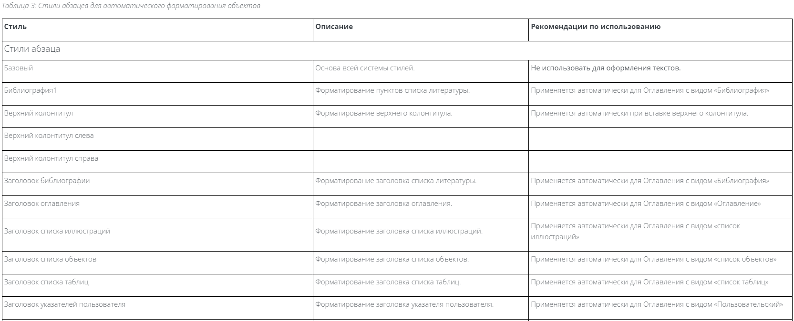
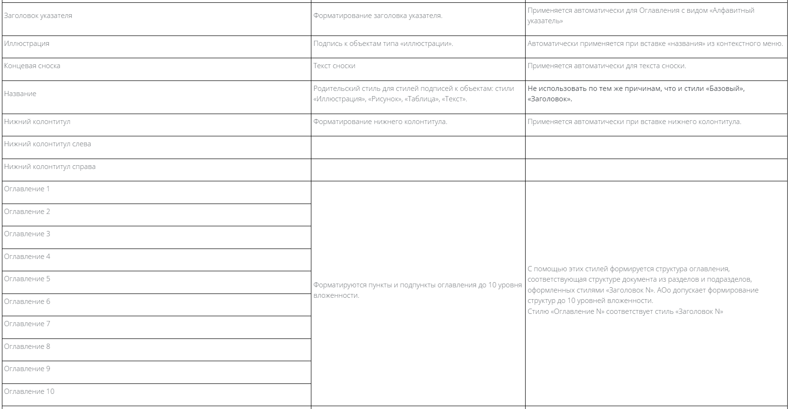
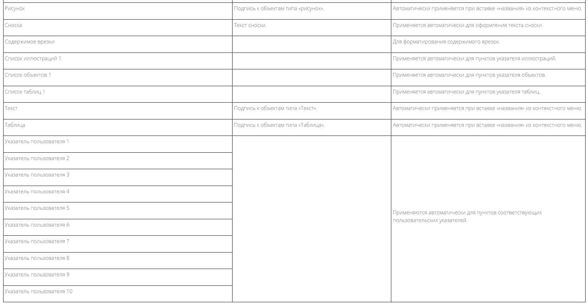
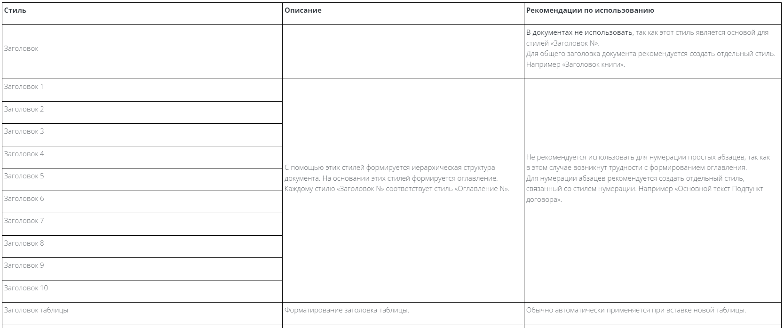
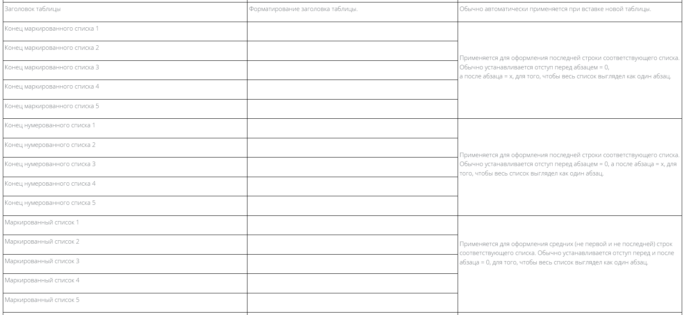
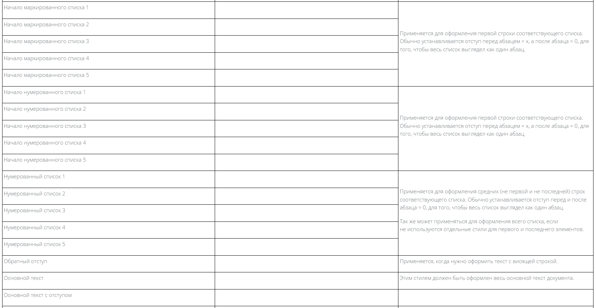
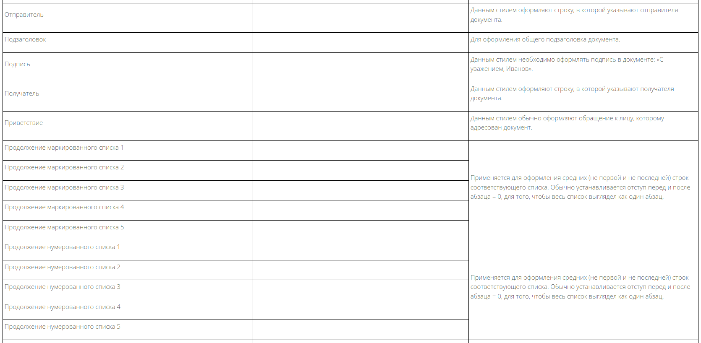

 

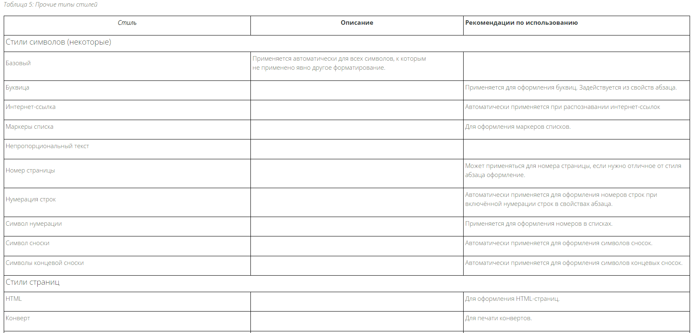
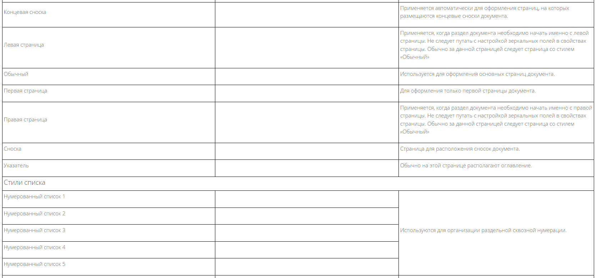
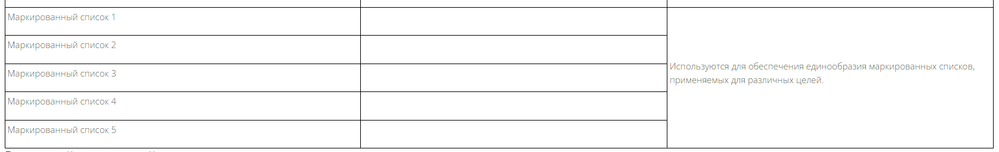

Отличительной особенностью системы стилей в AOo является то, что это цельная интегрированная система. Практически все типы стилей взаимодействуют с другими типами стилей.
Стили абзацев связываются со стилями списков для организации нумерации, стилями символов для оформления буквиц, стилями страниц для начала новых страниц; Стили списков связываются со стилями символов для оформления маркеров и номеров в списках.

### Управление стилями

При наборе текста действует комбинация механизма наследования и механизма управления. Абзацы наследуют от своего стиля. Но при нажатии [Enter] в конце абзаца срабатывает не наследование, а управление, в котором указывается, какой стиль применить к следующему абзацу. И уж затем новый абзац наследует свойства этого стиля. Далее срабатывает наследование второго уровня — на стиль абзаца накладываются стили символов, применённые к предыдущему абзацу.

Управление стилями позволяет указать, какой стиль должен быть у следующего абзаца. Наследование задаёт иерархию стилей.

Другими словами – можно создавать один стиль на основе другого (родительского), указав только отличия потомка от родителя. Например, стиль «Основной текст с отступом» может отличаться от родительского стиля «Основной текст» только наличием этого самого отступа. Это приводит к тому, что изменение гарнитуры в стиле «Основной текст» произойдёт так же и в стиле «Основной текст с отступом». Таким образом, если грамотно выстроить всю систему стилей, то, например, для изменения шрифта во всём документе необходимо будет ввести изменения только в одном месте. А если документ насчитывает сотни страниц – экономию времени даже подсчитать невозможно.

Ещё остановимся на свойстве управления – Следующий стиль. Кратко об этом упоминалось выше. Что это даёт на практике. Допустим, после каждого заголовка первого уровня следует некий эпиграф или вводная, которая должна быть выделена курсивом и иметь большие отступы справа и слева. За вводной следует основной текст, но с буквицей. За этим абзацем – снова основной текст.

## Проверка орфографии

OpenOffice Writer изначально рассчитан на мультиплатформенную работу и мультиязыковые тексты. Соответственно его возможности расширены. В нём введено понятие язык текста. Язык текста в Writer'е является частью стиля абзаца. Поэтому при наборе текстов, где есть вставки на других языках, достаточно для таких вставок создать отдельный стиль и указать в нём соответствующий язык. Тогда проверка орфографии пройдёт корректно для всего текста, независимо от того, на каком языке он написан.
## Концепция шаблонов

Шаблон – это документ, используемый для создания на его основе других документов. Аналогом шаблона в канцелярской практике является бланк. В шаблоне как и в бланке присутствуют все необходимые для данного документа элементы, а для изменяемой информации отводятся специальные места.

Также, как отмечалось в разделе «Создание новых (пользовательских) стилей», одно из главных предназначений шаблона — хранить настроенные пользовательские стили и выполнять роль бланка для повышения производительности труда.

## Шаблоны

В любой организации в обязательном порядке должен быть набор корпоративных шаблонов — шаблонитарий. И на первом месте в этом наборе стоит бланк организации. ГОСТ Р 6.30-2003 предъявляет строгие требования к информации, размещаемой на бланках, и к её расположению. Согласно ГОСТу на бланке необходимо размещать основные реквизиты организации, в частности — банковские. С учётом того, что организация может часто менять банк, а документы на бланке может выписывать множество сотрудников, то поддержание даже одного бланка в актуальном состоянии в рамках всей организации превращается в проблему.

Для решения этой задачи в AOo есть механизм организации шаблонитария.

Шаблонитарий
Организация шаблонитария
Для его организации на сервере предприятия создаётся отдельная папка. Путь к данной папке указывается в настройках AOo. Далее в этой сетевой папке создаются вложенные папки с осмысленными названиями, в которых будут размещаться сами шаблоны. Структура должна быть именно такая, как указано ниже. Большая вложенность папок игнорируется. Например, вложенные папки могут иметь следующие имена:

- Бланки общие
- Отчёты
- Отдел коммерческий
- Отдел сбыта
- Договора

### Корпоративный стиль или Последовательность создания шаблонов
Прежде чем приступить к созданию шаблонитария, необходимо определить единый корпоративный стиль оформления документов. Технически это выглядит как создание первичного шаблона (назовём его протошаблон) и дальнейшее создание на его основе всех остальных шаблонов.

Минимум, что определяется в протошаблоне — это какие шрифты употребляются для оформления основного текста и заголовков с 1 по 10 уровни, каков их кегль и начертание. Оптимальным является полная проработка всех стилей, присутствующих в Стилисте и создание своих собственных стилей. Больше в этом шаблоне не должно быть ничего. То есть он представляет из себя пустой лист и набор стилей.

Это кропотливая работа должна быть выполнена. Результатом будет единообразие всех документов, создаваемых в организации.

Далее на основании протошаблона создаются все остальные шаблоны, которые уже являются бланками конкретных документов. При создании этих шаблонов уже не нужно задумываться о том, как должны выглядеть стили. Работа ведётся над тем, какие стили и где использовать.

### Защита шаблонов

Шаблонитарий можно защитить от изменения не уполномоченными на то сотрудниками. Это делается с помощью прав доступа средствами операционной системы.

В результате подключаемые на рабочих местах сетевые каталоги с шаблонами становятся доступны только для чтения. Открытые из них шаблоны невозможно изменить штатными средствами AOo. При необходимости изменений оные вносятся с центрального рабочего места уполномоченным сотрудником.

## Концепция электронных таблиц

Электронные таблицы — это простейший способ автоматизации вычислительных задач без программирования!

Они очень разные по своему назначению, а значит и по свойствам. Электронные таблицы — предназначены в первую очередь для вычислений и в двадцатую — для оформления. Текстовые — с точностью до наоборот. Поэтому в текстовых таблицах возможны вложенные таблицы, разделённые / объединённые ячейки и т. п. А в электронных таблицах этого нет. Текстовые таблицы — иерархические, а электронные таблицы — реляционные.

Именно поэтому к планированию документа электронной таблицы нужно подходить с большей ответственностью, чем к текстовому документу, потому что может сложиться ситуация, когда будет создан документ электронной таблицы с сотнями строк и столбцов, имеющих сложные объединения и заполненный данными, который не будет поддаваться модификации.

Некоторых пользователей смущают имеющиеся базовые ограничения электронных таблиц, не позволяющие обращаться с ними так же вольготно, как с текстовыми. Особенно много жалоб есть на невозможность разбить одну ячейку на несколько.

Следует отметить, что этого никогда не делала ни одна электронная таблица (со времён DOS'а) и вряд ли будет делать впредь, поскольку данное действие несовместимо с базовой концепцией электронных таблиц. И Calc здесь не исключение.

### Базовая концепция электронной таблицы

Базовая концепция электронной таблицы состоит из двух аспектов: 

- ячейки
- содержимого ячейки

Такой «аскетизм» вызван предназначением электронных таблиц, которое состоит в вычислениях. При этом оформительские свойства являются опцией третьего порядка.

Несколько ячеек могут быть объединены в одну, но одна не может быть разделена на несколько. Эмулирование разделения ячейки происходит исключительно через добавление целого столбца или целой строки.

Ячейка всегда имеет адрес в виде двух чисел — «строка» и «столбец». При этом столбец может иметь символьную нумерацию. Это два измерения адресации. Опционально есть и третье измерение адресации — «лист».

Это значит, что весь язык листа электронной таблицы адаптирован именно под такую адресацию.

Второй аспект — «содержимое ячейки». Оно может быть лишь двух видов:

- данные
- формула

Когда таблица состоит из многих сотен последовательно рассчитываемых формул, когда на вход следующей формулы подаются результаты вычисления предыдущей. При этом входные параметры расчётов часто изменяются, а массив формул остаётся неизменным. Именно разделение данных и формул в разных ячейках позволяют выполнять мгновенный пересчёт сложнейших таблиц за доли секунды лишь введя новые значения в отдельные ячейки.

### Автоматизация в электронных таблицах

Автоматизация в электронных таблицах состоит из следующих составляющих:

- совмещение бланка документа и автоматизация процедуры его заполнения
- автоматизация за счёт изменения значений без изменения формул
- условное форматирование в зависимости от результата
- подбор значений — анализ «а что, если»
- создание собственных функций
- графический анализ данных

### Совмещение бланка документа и автоматизация процедуры его заполнения
Современные электронные таблицы позволяют оформить лист таблицы в виде бланка документа. При этом, встроенными средствами таблицы, можно чётко разделить текст бланка, поля для заполнения — ввода данных, и поля результатов расчётов формул. И текст бланка, и формулы будут защищены от изменения.

### Автоматизация за счёт изменения значений без изменения формул

Вот две формулы:
- =10/2
- =a1/a2

Если в ячейках А1 и А2 введены 10 и 2 соответственно, то обе формулы дадут одинаковый результат. Но, при этом, формула (1) является ошибочной, так как она содержит в себе данные. Ошибка заключается в логике, потому что:

- исходные данные не видны при просмотре таблицы
- при необходимости изменения параметров расчёта необходимо
    - найти формулу в таблице
    - внести исправления в формулу, что чревато ошибкой

Поэтому верной является формула (2).

### Перемещение абзацев

Если нужно переместить один абзац — ничего выделять не нужно, достаточно, чтобы курсор был в исходном абзаце, который требуется переместить. Для перемещения группы абзацев — их нужно выделить. Для перемещения вверх нужно нажать [Ctrl]+[Alt]+[↑], а для перемещения вниз — [Ctrl]+[Alt]+[↓].

### Стилист

Всё форматирование зиждется на стилях

Стилист сам по себе уникален тем, что позволяет быстро и удобно управлять всем многообразием стилей. Причём разные типы стилей разбиты по группам и не сваливаются в одну кучу. С помощью Стилиста можно создавать новые стили 2 путями.

- Первый – в меню стилиста выбирается команда «Создать». Будет создана копия стиля с новым именем.
- Второй способ – в документе вводится текст и полностью форматируется. Затем отформатированный текст выделяется и в Стилисте выбирается команда Создать стиль из выделенного.

Так же Стилист позволяет загружать готовые наборы стилей из шаблонов или из файлов документов.

### Стили абзаца
При работе с абзацами так же реализовано наследование стилей абзацев. Наследование происходит от первого абзаца ко второму.

### Стили символов

Буквица это старинный приём оформления текста. К сожалению – сейчас редко где используется. И практически не встречается в офисных документах. И для этого были чисто технические причины – данный тип оформления не поддерживался текстовыми процессорами. По логике – оформление буквицы отличается от оформления основного текста как минимум шрифтом. Поэтому в стиле символа Буквица устанавливают шрифт данного символа. А в стиле абзаца на вкладке Буквица указывают соответствующий стиль символа.

Следующий пример использования стиля символов – в маркированных списках. Для этого создаётся стиль символа Символ нумерации в котором указывают какой тип маркеров будет использоваться. Затем данный стиль привязывается с стиле списка для маркеров.

### Стили врезок
Часто в текст необходимо делать различные вставки. Это могут быть текстовые врезки, иллюстрации, формулы, и т. д. Врезка обычно оформляется особым образом. Для неё выставляется обтекание, отступы и тому подобные признаки. Writer предлагает 7 типов врезок:

- OLE
- Водяные знаки
- Врезка
- Заметки
- Изображения
- Подписи
- Формула

Из названия стилей врезок видно для чего они предназначены. С их помощью можно оформить практически все вставки в документ.

Главной особенностью врезки является то, что основной текст документа будет её обтекать.

### Стили страниц

Колонтитул – это элемент оформления страницы. Так же как и размер полей, и ориентация оной в пространстве. Следовательно, колонтитул в OpenOffice является элементом стиля страницы.

В управлении стилем страницы настраивается, какая страница будет следовать за текущей. Например в стиле Первая страница в управлении в разделе Следующий стиль указывается Обычный.

В разделе Столбцы указывается сколько столбцов будет на странице с данным стилем.

В разделе Сноска настраиваются области сносок и разделительные линии.

В разделах Колонтитулы верхний и нижний настраивается наличие колонтитулов на страницах с данным стилем и параметры колонтитулов.

В разделе Формат бумаги настраивается ориентация, размер, поля страницы.

### Стили списков
В стилях списков есть два типа. Это Нумерации и Списки. Особенность применения стилей нумерации состоит в том, что можно организовать разорванную нумерацию в документе. Причём количество таких разорванных нумерованных списков может быть неограниченно.

Итоги работы со Стилистом
Подведём некоторые итоги по применению стилей:

- стилевое оформление охватывает все типы элементов в документе.

- время, затраченное на создание системы стилей, приводит к системному сокращению временных затрат на порядки.

- получаются документы профессионального качества.

На основании всего вышеизложенного можно сформулировать тезис: «Сначала стили, затем документы».

## Вычисления в текстовом документе

В OpenOffice Writer вычисления можно делать в любом месте документа. Для этого достаточно нажать [F2] и появится панель ввода формул, как в электронной таблице. Соответственно, и правила работы такие же, как и с электронной таблицей.

Точно так же этот механизм доступен и в любой таблице текстового документа. Ячейки в таблице текстового документа адресуются так же, как это принято в электронных таблицах. Имя таблицы и адрес ячейки отображаются в правой части статусной строки.

## Управляемые документы

Использование стилей позволяет подойти к такому понятию, как управляемость документа. Только когда каждый элемент электронного документа имеет поименованный признак (коим и является стиль), то только тогда можно управлять таким документом.

OpenOffice не только построен на объектной модели, но и повсеместно её использует. В документ можно вставлять такие объекты, как

- таблицы
- врезки
- изображения
- OLE объекты
- закладки
- разделы
- гиперссылки
- ссылки
- указатели
- примечания
- графические объекты

По умолчанию, каждому новому объекту присваивается имя вида <Тип_объекта_порядковый_номер>. Эти имена можно изменять. Необходимо каждому такому объекту присваивать нормальное значащее имя. Только в этом случае можно будет легко найти то что нужно в структуре документа. Это — во-первых. Во-вторых, использование «человеческих» имён объектов предохранит от ошибок в работе с документом.

Когда текст документа весь оформлен с использованием стилей, тогда появляется возможность автоматически создавать различные указатели:

- Общее оглавление документа.
- Оглавление глав.
- Оглавление таблиц.
- Оглавление рисунков.
- Библиография.

У управляемых документов есть ещё один аспект — AOo постоянно отслеживает актуальность шаблона, на основе которого создан документ и состояние документа.

Это означает, что в шаблоне, на котором основан документ, произошли изменения после создания документа. Предлагается обновить стили в соответствии с текущим состоянием шаблона.

Таким образом становится возможным все документы привести в соответствие с новой системой стилей.

## Навигатор 
Из всего вышеизложенного логические вытекает, что если все элементы документа поименованы, то к ним можно быстро получить доступ. И это совершенно очевидно и логично. И такой быстрый доступ к объектам документа реализован с помощью инструмента «Навигатор» ([F5]). Аналогов этому инструменту в прочих текстовых процессорах нам не встречалось.

Навигатор позволяет получить мгновенный доступ к свойствам любого объекта документа, давать имена объектам, перемещать их. Для навигации в документе достаточно дважды щёлкнуть на имени объекта, чтобы мгновенно переместиться к нему. Все элементы документа в Навигаторе сгруппированы по их типам — заголовки, таблицы, закладки, рисунки, текстовые врезки, ссылки, указатели и так далее. В общем — в Навигаторе представлены абсолютно все типы объектов, которые могут присутствовать в документ.

Упорядочение глав с помощью Навигатора

Мощнейшей функцией Навигатора является возможность одним щелчком перемещать целые главы в документе. Хотим особо заострить ваше внимание на этой возможности OpenOffice, так как аналогичные функции либо вовсе отсутствуют в других офисных пакетах, либо реализованы там частично.

С помощью этой функции вы можете одним щелчком мыши передвигать подразделы, разделы и целые главы со всем их содержимым в любое место документа вверх или вниз. При этом, если главы и разделы были пронумерованы, то OpenOffice автоматически откорректирует всю нумерацию. Более того – будет сохранена и вся ссылочная целостность документа – все ссылки так же будут автоматически откорректированы! Это похоже на управление списками, которое было разобрано ранее в разделе «Оперативное управление списком в документе» на стр. 68.

Для этого:

Нажмите кнопку Содержание.

Выберите нужный заголовок.

Перетащите заголовок в новое место в Навигаторе или выберите заголовок в списке Навигатора, а затем нажмите кнопки Перенести вверх или Перенести вниз.

## Раздельная и множественная нумерация 

При подготовке сложных документов редко можно обойтись одной нумерацией страниц. Например, техническое руководство по программе может иметь следующую структуру:

Обложка и форзацы — не нумеруются;

Краткое и полное оглавления — собственная нумерация римскими цифрами;

Раздел основного текста, разбитый на главы — основная нумерация документа арабскими цифрами.

Приложения — собственная нумерация с префиксом в виде номера приложения.

Вся прелесть в том, что Writer позволяет без труда всё это реализовать.

Для этого необходимо для каждого логического раздела документа подготовить необходимые стили страниц. Одна из причин, почему это надо сделать — разные колонтитулы страниц, в которых будет выводиться раздельная нумерация оных.

Что ж, предположим, что нам нужна следующая система стилей страниц для нашего сложного документа:

- Титул
- Выходные данные
- Указатель краткий Первая страница
- Указатель краткий
- Указатель Первая страница
- Указатель
- Предисловие Первая страница
- Предисловие
- Первая страница главы
- Обычный
- Приложения Первая страница
- Приложения
- Оконечные страницы
- Последняя страница обложки.

Для упрощения мы остановимся только на одном способе задания номера и стиля страницы — через свойства абзаца.

Следует отметить, что заданный однажды стиль страницы действует от того абзаца, в котором он задан до следующего абзаца, в коем принудительно указан новый стиль страницы.

Таким образом, применять сознанные нами стили страниц мы будем следующим образом. Устанавливаем курсор в первый абзац новой страницы (в это момент он ещё может быть далеко не первым, а находиться, например, посередине текущей) и через контекстное меню переходим в свойства абзаца.

Далее, выбираем вкладку Положение на странице. На этой вкладке нас интересует раздел Разрывы. В этом разделе мы устанавливаем все флаги: Добавить разрыв и Со стилем страницы. В разрыве мы указываем тип Страница, а в стиле страницы выбираем необходимый нам сейчас стиль. Следует обратить особое внимание на параметр Номер страницы. Если он равен нулю, то это обозначает, что, несмотря на разрыв и новый стиль страницы нумерация страниц будет продолжена без перерыва. Что это значит на практике? В нашем случае с Техническим руководством титульный лист и страница выходных данных не имеют нумерации. Затем следуют два оглавления — краткое и подробное. Краткое занимает одну, от силы — две страницы. Подробное же может быть весьма объёмным — до нескольких десятков.

Для этих оглавлений будут задействованы стили страниц: Указатель краткий Первая страница, Указатель краткий, Указатель Первая страница, Указатель. Итого — четыре стиля страниц. Но, при этом, логично, чтобы эти два разных оглавления имели одну сквозную нумерацию страниц. Именно для этого и существует параметр Номер страницы. В стиле страницы Указатель краткий Первая страница мы установим Номер страницы равным 1, а в остальных стилях страниц Указатель краткий, Указатель Первая страница, Указатель параметр Номер страницы будет равен нулю

## Вставка разделителей разрядов 
Часто возникает ситуация, когда нужно найти текст, удовлетворяющий определённым условиям и откорректировав его, вставить его назад.

Становится очевидной проблема, что «поиск по строке» непригоден, так как «искомая строка» будет в каждом случае разной. И простая замена на «строковое выражение» то же не подойдёт, так как нам нужно не просто найти определённую строку, и заменить её на другую, а произвести замену внутри найденной строки и результат вставить обратно в документ.

В таком случае на помощь приходят регулярные выражения.

Вставка разделителей разрядов
Например различные отчёты. В России принято разряды отделять пробелами. Часто, когда отчётом является текстовый документ, оказывается, что разряды не отделены вовсе, или отделены простыми пробелами. В первом случае такие отчёты трудно читать, во втором — при обработке текста такие числа могут разрываться на несколько строк, или пробелы становятся слишком широкими и цифры разрываются.

С помощью регулярный выражений данная операция выполняется за один присест.

Для первого случая, когда нет пробелов между разрядами вообще в диалоге «Найти и заменить» нужно нажать кнопку «Больше параметров» и установить флажок «регулярные выражения». Затем

в строке поиска ввести
([:digit:])([:digit:]{3})([:space:]|\.|,|\n|$)

в строке замены ввести $1неразрывный пробел$2$3

Примечание В данном диалоге нельзя непосредственно ввести символ «неразрывный пробел». Но его можно предварительно ввести в документ, вырезать в документе и вставить в нужном месте в строке поиска или замены. Таким образом в строке $1 $2 на самом деле не пробел, а именно «неразрывный пробел».

Для второго случая, когда разряды отделены простыми пробелами, строка поиска будет отличаться лишь наличием простого пробела после первой скобки, а строка замены не изменится. В диалоге «Найти и заменить» нужно нажать кнопку «Больше параметров» и установить флажок «регулярные выражения». Затем

в строке поиска ввести
([:digit:])пробел([:digit:]{3})([:space:]|\.|,|\n|$)

в строке замены ввести $1неразрывный пробел$2$3

Что делает данная комбинация регулярных выражений? Разберём их по элементам.

Здесь работает следующий алгоритм, в котором, часть того, что находим, нужно вставить назад без изменений:

- нужно найти строку, состоящую из 1 + 3 цифры подряд, за которыми следуют:
    - или пробел,
    - или точка,
    - или разрыв строки,
    - или конец абзаца
  
- разделяем строку поиска на переменные:
    - объявляем первую цифру — первой переменной,
    - объявляем последующие три цифры — второй переменной,
    - объявляем всё, что следует за цифрами — третьей переменной,

- в строку замены вставляем:
    - первую переменную без изменений, за ней
    - неразрывный пробел, за ним
    - вторую и третью переменные без изменений.

Почему мы ищем 1 + 3 цифры, на не 4 сразу? Потому что нам их надо разорвать и вставить между ними неразрывный пробел. Далее, нам надо заставить, фактически, искать выражение с конца строки — справа налево, поскольку разряды отсчитываются именно от правого конца цифры. Именно поэтому нам надо задать то, чем может оканчиваться последовательность цифр, иначе система найдёт первые четыре левых цифры.

Для того, чтобы строку поиска разбить на части используются скобки (). Всё, что найдено внутри скобок запоминается, как переменная. Эти переменные нумеруются последовательно тому, сколько их есть в строке поиска. Для того, чтобы вставить переменную из строки поиска в строку замены нужно использовать $n, где n — порядковый номер переменной в строке поиска. Именно поэтому конструкция $1неразрывный пробел$2 позволяет вставить между четырьмя следующими друг за другом цифрами неразрывный пробел. Ну и последнее — нам надо вставить назад всё то, что было найдено после цифр. Для этого служит $3 — вставляет то, что мы назвали третьей переменной.

А что значат сами иероглифы

[:digit:]

{3}

[:space:]

|

\.

|

,

|

\n

|

$

[:digit:] — обозначает любой цифровой символ;

{3} — указывает, что предыдущий элемент должен следовать трижды;

[:space:] — обозначает пробел;

| (вертикальная черта) — обозначает команду ИЛИ,

\. — обозначает «найти точку»

, — обозначает «найти запятую»

\n — обозначает разрыв строки

$ — обозначает конец абзаца.

Кстати, кто понаблюдательней, вероятно уже заметил, что для поиск точки и запятой отличается — перед точкой стоит обратный слэш, а перед запятой — нет. Ответ прост. Точка является спецсимволом в регулярных выражениях, обозначающих «любой один знак». Поэтому, чтобы найти именно точку, перед ней надо поставить обратный слэш.

Таким образом, строка поиска ([:digit:])([:digit:]{3})([:space:]|\.|,|\n|$) читается так: «найти цифру и следующие за ней следующие три цифры. Запомнить первую цифру, как ссылку 1, следующие три цифры, как ссылку 2, а следующие за ними или пробел, или точку, или разрыв строки, или конец абзаца, запомнить как ссылку 3».

Для нашего второго случая, когда разряды отделены простыми пробелами, в строке поиска после первых скобок стоит пробел. Таким образом, строка поиска ([:digit:])пробел([:digit:]{3})([:space:]|\.|,|\n|$)

«найти цифру, отделённую от следующих трёх цифр пробелом. Запомнить первую цифру до пробела, как ссылку 1, следующие три цифры, как ссылку 2, а следующие за ними или пробел, или точку, или разрыв строки, или конец абзаца, запомнить как ссылку 3, а следующие за ними или пробел, или точку, или разрыв строки, или конец абзаца, запомнить как ссылку 3».

Соответственно, строка замены $1 $2$3 будет работать следующим образом: «Вставить текст ссылки 1, после неё вставить «неразрывный пробел», за ним вставить текст ссылки 2 и сразу текст ссылки 3».

Теперь только остаётся нажать кнопку «Заменить все» для запуска на выполнение нашей замены.

Примечание Возможно, кнопку «Заменить все» нужно будет нажать несколько раз, до тех пор, пока не будет выдано сообщение, что «Слово не найдено».

## Вставка неразрывных пробелов после инициалов 
Согласно правилам русского языка, на письме инициалы отделяются пробелами. Причём, согласно традициям русской типографики, эти пробелы должны быть неразрывными, так как не принято инициалы отделять от фамилии.

Таким образом, для того, чтобы строку «И.пробелО.пробелФамилия» заменить на «И.неразрывный пробелО.неразрывный пробелФамилия» нужно произвести такую же простую комбинацию, как и выше. Только строка поиска будет следующей:

([А-Я]\.)пробел([А-Я]\.)пробел([А-Я][а-я]+)

Строка замены, соответственно, такая:

$1неразрывный пробел$2$3

Это только два примера того, как легко с помощью регулярных выражений можно выполнять сложные вещи.

## Шаблоны в шаблонах? Автотекст 
Мы уже разобрались в концепциях стилей и шаблонов. На практике увидели их ценность и освоили приёмы работы с ними. Однако в жизни встречаются и промежуточные элементы — которые больше, чем стиль, и меньше, чем шаблон. Это повторяющиеся части документов.

Например:

блок подписи с прочерком для росписи, фамилией и местом для печати;

стандартное приветствие;

особым образом отформатированная таблица с заполненными заголовками строк и столбцов;

«рыбу» для вставки в документ целых разделов с определёнными заголовками и обязательными фразами;

и т. д.

Автотекст разрешает вам связать текст, таблицы, графику и другие элементы с определённой последовательностью букв. Например, вместо ввода каждый раз таблицы со списком сотрудников и их координатами, которые обязаны проставить визы на документе вы можете ввести только «визы» и нажать клавишу [F3]. Разумеется такую таблицу нужно вначале один раз создать и вставить в автотекст.

## Типовые договора 
Отличием договоров от остальных документов является то, что все абзацы (кроме первых двух) имеют сквозную нумерацию и перекрёстные ссылки.

Для оформления договора обычно недостаточно предопределённых стилей, поскольку нет стандартных стилей, связанных с нумерацией.

Итак, что понадобится.

Для заголовка самого договора создать новый стиль абзаца «Заголовок договора». Родительским стилем для него будет «Заголовок» а в параметре «следующий стиль» указываем — «Основной текст».

Для преамбулы, в которой указывается, кто с кем заключил договор — используем стандартный стиль абзаца «Основной текст».

Для нумерации пунктов договора понадобится стиль списка в котором настраиваем требуемую структуру нумерации. Назовём его «Список Договор». О нём немного подробнее. Обычно договора подразделяются на статьи:

- предмет договора,

- цена и порядок расчётов,

- ответственность сторон,

- реквизиты сторон,

- и т. д.

Часто перед номерами этих пунктов пишут слово «Статья». Это легко делается. В свойствах стиля переходим на вкладку «Параметры» и для первого уровня списка в графе «До» пишем «Статья пробел». Всё остальное настраиваем по потребностям. Разумеется, данный список имеет многоуровневую структуру, чтобы подпункты статей были чётко видны.

Для пунктов договора создаём стиль абзаца «Заголовок пункта договора». Родительским стилем для него будет «Заголовок 1». Остальные его параметры настраиваются чуть позже, так как надо создать ещё несколько стилей, с которыми данный стиль будет связан.

Для подпунктов договора создаём стиль абзаца «Основной текст договора». Родительским стилем для него указываем стиль «Основной текст», поскольку единственное отличие от него будет в наличии нумерации, а в параметре «следующий стиль» указываем его самого — «Основной текст договора». Далее на вкладке «Структура и нумерация» уровень структуры указываем «Основной текст», а стиль нумерации — созданный нами ранее стиль «Список Договор».

Далее — возвращаемся к стилю «Заголовок пункта договора» — у него на вкладке «Структура и нумерация» уровень структуры указываем «Уровень 1», а стиль нумерации — созданный нами ранее стиль «Список Договор», а в параметре «следующий стиль» указываем — «Основной текст договора».

Всё. Структура стилей готова.

Как она работает:

Набирается заголовок договора, ему присваивается стиль «Заголовок договора». Далее следует преамбула «Стороны заключили настоящий договор...», которой присваивается стиль «Основной текст».

Далее вводится название первой статьи договора «Предмет договора» и присваивается ей стиль «Заголовок пункта договора». У абзаца появляется номер «Статья 1». Нажимается [Enter]. Следующий абзац автоматически получает стиль «Основной текст договора» и имеет номер. Однако номер нас не устраивает — он «Статья 2». То есть он получил первый уровень списка. Нам же нужно, чтобы он стал вторым уровнем. Для этого нажимаем [Tab] для того, чтобы переместить пункт списка на уровень ниже. В результате получаем номер у абзаца «1.1.». Что нам и нужно. После этого начинаем набирать текст подпункта.

Когда потребуется начать следующий пункт — повторяем действия, как для предыдущего пункта.

Таким образом, глобальная нумерация пунктов договора получается элементарно.

Следующее, что чрезвычайно часто встречается в договорах — ссылки на другие пункты этого же договора. И здесь кроется большая проблема — необходимо отслеживать корректность этих ссылок при редактировании договора, поскольку нумерация может смещаться. Для этой цели используется перекрёстная ссылка на нумерованные абзацы.

Собственно всё, что нужно для оформления договора — готово.

Теперь полученный результат можно сохранить в шаблоне.

## Сложная нумерация глав 
Есть сложные документы, в которых для одного уровня заголовков должна быть разная нумерация.

Примером такого документа может служить договор с приложениями. В таком файле статьи договора и заголовки приложений являются заголовком одного уровня. Каждый заголовок в договоре должен быть пронумерован и предваряться словом «Статья». И заголовки приложений так же должны иметь свою нумерацию и предваряться словом «Приложение». При этом необходимо обеспечить корректную нумерацию без ручного вмешательства и присутствие данных заголовков в одном уровне оглавления.

Для этого потребуется для каждой нумерации создать пару соответствующих им стилей абзаца и списка, как это было показано ранее. Допустим, это будут «Заголовок Договор» + «Список Договор» и «Заголовок Приложение» + «Список Приложения».

Далее, для стилей абзацев «Заголовок Договор» и «Заголовок Приложение» в свойствах «уровнем структуры» указывается «Уровень 1», а «стиль нумерации» — «Список Договор» и «Список Приложения» соответственно.

Осталось присвоить абзацам соответствующие им стили.

Таким образом можно оформить неограниченное количество нумераций в пределах одного уровня заголовков.

## Циркулярное письмо 
О таком древнем канцелярском документе многие офисные работники даже не слышали, хотя часто с ним сталкиваются.

Между тем, циркулярное письмо - письмо, направленное из одного источника в несколько адресов.

Под это определение подпадают все рассылки, отправляемые организациям в адрес своих клиентов. Современный офисный пакет позволяет такое письмо сделать персональным для каждого адресата. Более того, технически, к циркулярным письмам можно отнести и стандартные договора, основной текст которых не меняется от клиента к клиенту.

Для этих целей используется связка шаблона и базы данных AOo — Base.

Единственная функция Base, которая нас сейчас интересует это то, что он представляет инструментарий для доступа к зарегистрированным источникам данных. Таким образом, данные из любого источника становится возможным использовать в любом документе AOo, нажав всего лишь одну клавишу.

В качестве источника данных может выступать и файл электронной таблицы.

Покажем на примере, как вставить в документ OpenOffice Writer данных из базы данных или других файлов, содержащих структурированные данные. В качестве базы данных мы используем таблицу ods, в которой хранятся контактные данные.

## Использование закреплённых/плавающих окон и панелей инструментов 
Внешний вид AOo можно улучшить — сделать его более наглядным и менее утомительным для длительной работы.

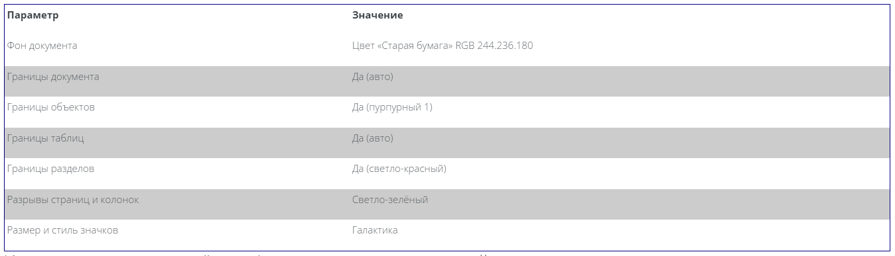

Использование закреплённых/плавающих окон и панелей инструментов
Панели инструментов и некоторые окна OpenOffice, такие как Навигатор и Стили и форматирование, являются закрепляемыми. Вы можете перемещать, изменять размеры или закреплять такие окна за край экрана.

Чтобы закрепить окно, выполните одно из действий:

Щёлкните по строке заголовка плавающего окна и переместите его в сторону, пока не увидите контур блока, появившийся в главном окне, затем отпустите кнопку. Этот метод зависит от настроек менеджера окон вашей системы, поэтому он может не работать.

Удерживая клавишу [CTRL], дважды щёлкните по пустой области плавающего окна, чтобы закрепить его в предыдущей позиции. Если это не работает, попробуйте дважды щёлкнуть без использования клавиши [CTRL].

Для открепления окна удерживайте нажатой клавишу [CTRL] и дважды щёлкните по пустой области закреплённого окна.

Примечание Окно Стили и форматирование можно закрепить или открепить также используя [CTRL]+[двойной щелчок] по серой области, расположенной справа от кнопок вверху окна.
