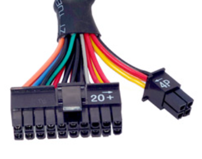
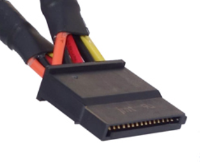
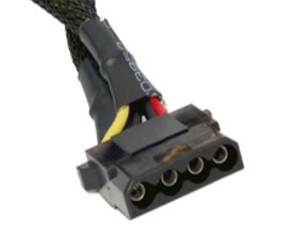
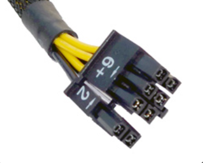
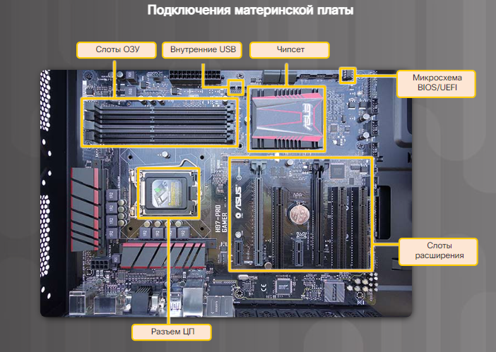
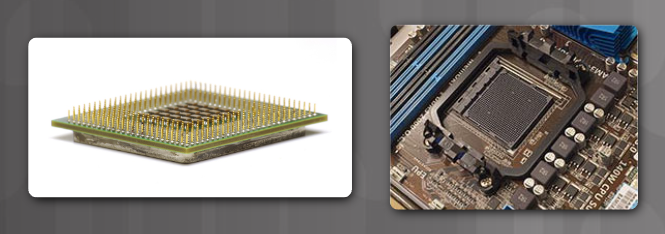
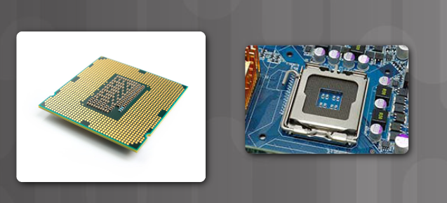

# Вопросы:

- [Форм-фактор определение и примеры.](#Форм-фактор%20определение%20и%20примеры.)

## Форм-фактор определение и примеры. Корпуса. Выбор корпуса и вентиляторов корпусов. 

Под форм-фактором устройства подразумевают его физическую конструкцию и внешний вид. Настольные компьютеры доступны в различных форма-факторах, в частности:

- Горизонтальный корпус 
- Полноразмерный вертикальный корпус 
- Компактный вертикальный корпус
- Моноблок 

Этот список не является исчерпывающим, поскольку многие производители корпусов имеют собственные системы классификаций. Например, вертикальный корпус большого размера - "полная башня", вертикальный корпус среднего размера - "средняя башня", вертикальный корпус мини - "мини башня".  

### Горизонтальный корпус
Корпус располагается горизонтально на столе, сверху устанавливается монитор. Был популярен на заре компьютерных сисем. Этот форм-фактор используется для ПК-домашних кинотеатров(HTPC).  

### Полноразмерный вертикальный корпус 
Этот корпус, как правило, размещается на полу, под столом или рядом с ним. Он обеспечивает достаточно пространство для размещения дополнительных компонентов, например, жестких дисков, плат, адаптеров и т.д.  

### Компактный вертикальный корпус
Уменьшенная версия полноразмерного вертикального корпуса. Часто встречается в корпоративной среде. Он также может называться вертикальным мини-корпусом или малым форм-фактором(SFF). Может размещаться на столе пользователя или на полу. Имеет ограниченное пространство для расширения.  

### Моноблок
Все компоненты компьютерной системы встроены в корпус монитора. Часто такая система имеет сенсорный экран и встроенные микрофон и динамики. В зависимости от модели, у моноблоков практически или полностью отсутсвуют возможности расширения. Блок питания часто является внешним модулем.  

Компоненты компьютера, как правило, выделяют много тепла. Поэтому компьютерные корпуса содержат вентиляторы, прокачивающие воздух через корпус. Воздух движется вдоль компонентов, забирает выделяемое ими тепло и выводится из корпуса. Этот процесс позволяет защитить компоненты компьютера от перегрева. Корпуса также спроектированы таким образом, чтобы обеспечить защиту от статического электричества. Внутренние компоненты компьютера заземляются путем прикрепления к корпусу.  

## БП. Форм-факторы и разъёмы. Выбор блока питания и корпуса

Электрические розетки обеспечивают электропитание в виде переменного тока. Однако всем компонентам компьютера для питания требуется постоянный ток. Для обеспечения постоянного тока компьютеры используют блок питания, чтобы преобразовывать переменный топ в постоянный с более низким напряжением.   

### Форм-факторы БП

 - __Advanced Technology (AT)__ - это оригинальный блок питания для компьютерных систем, считается устаревшим.
 - __AT Extended (ATX)__ - обновленная версия AT, но также считается устаревшей.
 - __ATX12V__ - самый распространненый на сегодняшний день. Включает допольнительный кабель для обеспечения выделенной цепи питания для ЦП. Доступно несколько версий.
 - __EPS12V__ - изначально создавался для сетевых серверов, но сегодня широко используется в топовых настольных моделях.  

Блок питания включает несколько различных разъемов, как показано здесь. Эти разъемы используются для подачи питания различным внутренним компонентам, таким как материнские платы и накопители. Разъемы оснащены "Ключами" и спроектированы нессиметричными, т.е. их невозможно вставить неправильно.  

### Разъемы

| виды и описание разъемов                                                                                                                                                                                                                                                              | как выглядит           |
| ------------------------------------------------------------------------------------------------------------------------------------------------------------------------------------------------------------------------------------------------------------------------------------- | ---------------------- |
| **20-контактный или 24-контактный щелевой разъем**     - подключается к материнской плате  - 24-контактный с двумя рядами по десять контактов в каждом  - 20-контактный щелевой разъем с двумя рядами по 10 контактов в каждом  |  |
| **Несимметричный разъем SATA**   - для подключения накопителей  - разъем шире и тоньше разъема Molex |    |
| **Несимметричный разъем Molex**   - для подключения жестких дисков, приводов, оптических дисков или других устройств ||
| **Несимметричный разъем Berg**  - для подключения устаревших дисководов, гибких дисков - меньше, чем размер Molex ||
| **4-8-контактный вспомогательный разъем питания**  - разъем имеет два ряда по два-четыре контакта в каждом и обеспечивают питанием различные части материнской платы - вспомогательный разъем питания имеет ту же форму, что и основной разъем питания, но меньше по размеру ||
| **6/8-контактный разъем питания PCIe**   - разъем имеет два ряда по три-четыре контакта в каждом и обеспечивает питание внутренних компонентов ||

### Напряжение блоков питания

На разные разъемы подаются разные напряжения. Наиболее распространенные: 3.3 В, 5 В и 12 В. Питание в 3.3 В и 5 В обычно испольуется цифровыми цепями, а питание в 12 В нужно для работы двигателей приводов в дисковых накопителях и вентиляторах. 

Блоки питания могут иметь одну, две или несколько шин питания для определенных напряжений. Подобная шина - это печатная плата (ПП) внутри блока питания, к которой подсоединяются внешние кабели. В случае с единственной шиной все разъемы присоденияются к одной ПП, а в случае с несколькими шинами для каждого разъема имеется отдельная ПП. 

Компьютер может работать при небольших колебаниях электропитания, но значительное отклонение может привести к отказу блока питания.   

## Материнская плата. Форм-факторы и компоненты. Характеристики выбора материнской платы

Материнская плата является основой компьютера. МП - это печатная плата, содержащая шины или электронные дорожки, соединяющие электронные компоненты друг с другом. Компонетны могут быть впаяны прямо в материнскую плату или устанавливаться в соответствующие разъемы, слоты расширения и порты. 

### Компоненты материнской платы:

- ЦП - мозг компьютера.
- ОЗУ - временное хранилище данных и приложений.
- Слоты расширения - места для подключения дополнительных компонентов.
- Чипсет - состоит из интегральных микросхем на материнской плате, которые управляют взаимодействием системного оборудования с ЦП и МП. Определяет сколько памяти можно добавить и тип разъемов на МП.
- Микросхема BIOS/UEFI - используется для загрузки компьютера и управления потоком данных между жестким диском, видеокартой, клавиатурой, мышью и т.д. UEFI - определяет другой программный интерфейс для служб загрузки и выполнения, но все еще полагается на традиционный BIOS для конфигурации системы, самотестирования при включении питания. 

 

### Чипсет материнской платы

- Северный мост - высокоскоростной доступ к оперативной памяти и видеокарте. Контролирует скорость взаимодействия ЦП с другими компонентами ПК. 
- Южный мост - дает ЦП взаимодействовать с более медленными устройствами, такие как: жесткие диски, порты USB и слоты расширения. 

 

### Форм-факторы материнских плат

Форм-фактор характеризует размер, форму, физическое расположение компонентов и устройств на МП.

- ATX - самый распространенный, корпуc ATX вмещает встроенные порты ввода/вывода на стандартной материнской плате ATX. Блок питания ATX подключается к материнской плате посредством одного 20-контактного разъема.
- Micro-ATX - уменьшенный, обратно совместимый с ATX. Используют те же наборы микросхем северного и южного мостов и разъемы питания, что и ATX. Намного меньше, чем ATX и имеют меньше слотов расширения.
- ITX - Существует много типов материнских плат ITX; однако Mini-ITX является одним из самых популярных. Форм-фактор Mini-ITX потребляет очень малую мощность, поэтому для его охлаждения вентиляторы не нужны. Материнская плата Mini-ITX имеет только один слот PCI для слотов расширения. Компьютер на базе форм-фактора Mini-ITX можно использовать в местах, где неудобно иметь большой или шумный компьютер. 

 

## ЦП, сокет. Повышение производительности. Системы охлаждения. Выбор этих компонентов

ЦП отвечает за интерпретацию и выполнение команд. Он обрабатывает инструкции от аппаратного (например, клавиатура) и программного обеспечения компьютера. Он интерпритирует инструкции и выводит информацию на монитор или выполняет запрошенные задачи. 

ЦП представляет собой небольшой микрочип. ЦП имеют разные форм-факторы. Каждый требует определенного типа разъема на материнской плате.  

Сокет (разъем ЦП) - соединение между материнской платой и процессором. 

### Современные архитектуры разъемов и корпусов ЦП:

- PGA - контакты находятся на нижней стороне ЦП и вставляются в разъем ЦП материнской платы без усилия. 
  
- LGA - контакты находятся в разъеме, а не на процессоре.
  

### Системы охлаждения

В результате движения электрического тока между электронными компонентами выделяется тепло. Компьютерные компоненты работают лучше, если они не перегреты. Если тепло не отводить, работа компьютера может замедлиться. Чрезмерное выделение тепла может привести к выходу компьютера из строя или повреждению его компонентов. Поэтому крайне важно защищать компьютеры от перегрева. 

Охлаждение компьютеров производится с помощью активных и пассивных систем охлаждения. Для активных систем требуется электропитание, а для пассивных — нет. Пассивные системы охлаждения обычно реализуются за счет снижения скорости работы компонента или добавление радиаторов к компьютерным микросхемам. Корпусной вентилятор считается активным охлаждением

