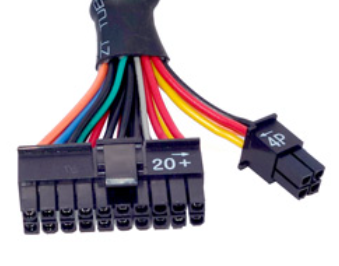
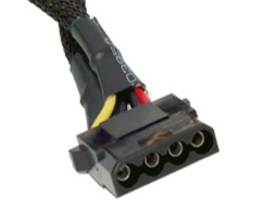
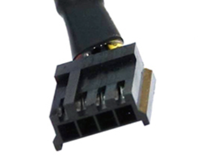
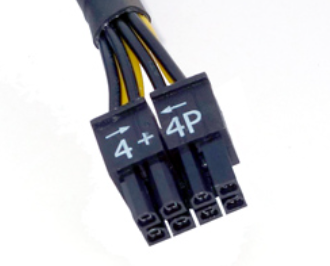
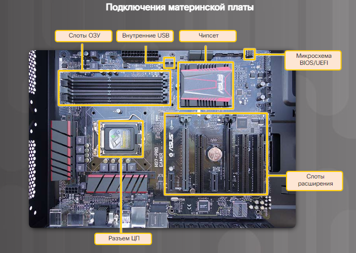
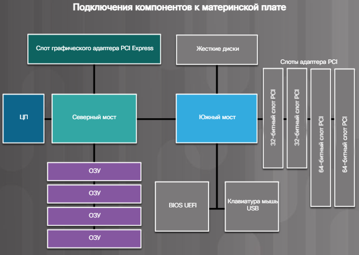
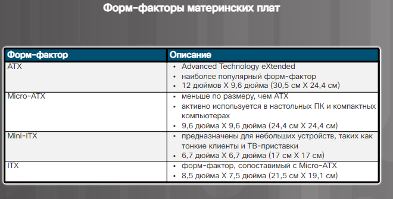
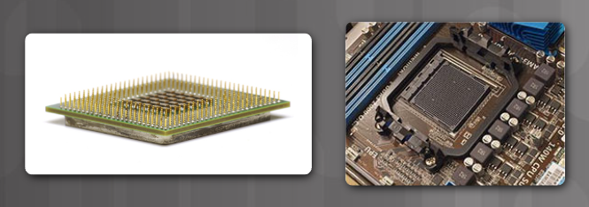
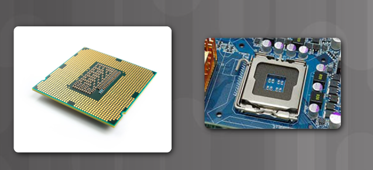
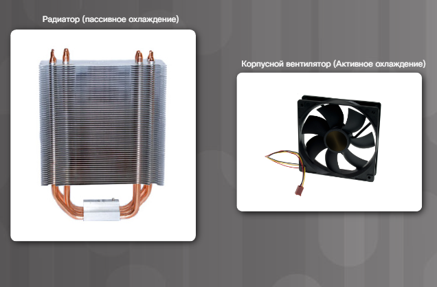

# Вопросы:

- [Форм-фактор определение и примеры.](#Форм-фактор%20определение%20и%20примеры.)

## Форм-фактор определение и примеры. Корпуса. Выбор корпуса и вентиляторов корпусов. 

Форм-фактором - это физическая конструкция и внешний вид устройства. 

### Форм-факторы:

- Горизонтальный корпус 
- Полноразмерный вертикальный корпус 
- Компактный вертикальный корпус
- Моноблок 

### Горизонтальный корпус
Располагается горизонтально на столе, сверху устанавливается монитор. Был популярен на заре компьютерных систем. Этот форм-фактор используется для ПК-домашних кинотеатров(HTPC).  

### Полноразмерный вертикальный корпус 
 Обеспечивает достаточно пространство для размещения дополнительных компонентов, например, жестких дисков, плат, адаптеров и т.д.  

### Компактный вертикальный корпус
Уменьшенная версия полноразмерного вертикального корпуса. Часто встречается в корпоративной среде. Может размещаться на столе пользователя или на полу. Имеет ограниченное пространство для расширения.  

### Моноблок
Все компоненты компьютерной системы встроены в корпус монитора. Часто такая система имеет сенсорный экран и встроенные микрофон и динамики. В зависимости от модели, у моноблоков практически или полностью отсутсвуют возможности расширения. Блок питания часто является внешним модулем.  

Компоненты компьютера, выделяют много тепла. Поэтому компьютерные корпуса содержат вентиляторы, прокачивающие воздух через корпус. Воздух движется вдоль компонентов, забирает выделяемое ими тепло и выводится из корпуса. Этот процесс позволяет защитить компоненты компьютера от перегрева. Корпуса спроектированы так, чтобы обеспечить защиту от статического электричества. Внутренние компоненты компьютера заземляются путем прикрепления к корпусу.  

## БП. Форм-факторы и разъёмы. Выбор блока питания и корпуса

Электрические розетки обеспечивают электропитание в виде переменного тока. Компонентам компьютера для питания требуется постоянный ток. Блок питания - преобразовывает переменный ток в постоянный с более низким напряжением.   

### Форм-факторы БП

 - __Advanced Technology (AT)__ - оригинальный блок питания для компьютерных систем, считается устаревшим.
 - __AT Extended (ATX)__ - обновленная версия AT, но также считается устаревшей.
 - __ATX12V__ - самый распространненый на сегодняшний день. Включает допольнительный кабель для обеспечения выделенной цепи питания для ЦП.
 - __EPS12V__ - изначально создавался для сетевых серверов, но сегодня широко используется в топовых настольных моделях.  

Блок питания включает несколько различных разъемов. Эти разъемы используются для подачи питания различным внутренним компонентам, таким как материнские платы и накопители. Разъемы оснащены "Ключами" и спроектированы нессиметричными, т.е. их невозможно вставить неправильно.  

### Разъемы

| виды и описание разъемов                                                                                                                                                                                                                                                              | как выглядит           |
| ------------------------------------------------------------------------------------------------------------------------------------------------------------------------------------------------------------------------------------------------------------------------------------- | ---------------------- |
| **20-контактный или 24-контактный щелевой разъем**     - подключается к материнской плате  - 24-контактный с двумя рядами по десять контактов в каждом  - 20-контактный щелевой разъем с двумя рядами по 10 контактов в каждом  |  |
| **Несимметричный разъем SATA**   - для подключения накопителей  - разъем шире и тоньше разъема Molex |    |
| **Несимметричный разъем Molex**   - для подключения жестких дисков, приводов, оптических дисков или других устройств ||
| **Несимметричный разъем Berg**  - для подключения устаревших дисководов, гибких дисков - меньше, чем размер Molex ||
| **4-8-контактный вспомогательный разъем питания**  - разъем имеет два ряда по два-четыре контакта в каждом и обеспечивают питанием различные части материнской платы - вспомогательный разъем питания имеет ту же форму, что и основной разъем питания, но меньше по размеру ||
| **6/8-контактный разъем питания PCIe**   - разъем имеет два ряда по три-четыре контакта в каждом и обеспечивает питание внутренних компонентов ||

### Напряжение блоков питания

На разные разъемы подаются разные напряжения. Наиболее распространенные: 3.3 В, 5 В и 12 В. Питание в 3.3 В и 5 В обычно испольуется цифровыми цепями, а питание в 12 В нужно для работы двигателей приводов в дисковых накопителях и вентиляторах. 

Блоки питания могут иметь одну, две или несколько шин питания для определенных напряжений. Подобная шина - это печатная плата (ПП) внутри блока питания, к которой подсоединяются внешние кабели. В случае с единственной шиной все разъемы присоденияются к одной ПП, а в случае с несколькими шинами для каждого разъема имеется отдельная ПП. 

Компьютер может работать при небольших колебаниях электропитания, но значительное отклонение может привести к отказу блока питания.   

## Материнская плата. Форм-факторы и компоненты. Характеристики выбора материнской платы

Материнская плата является основой компьютера. МП - это печатная плата, содержащая шины или электронные дорожки, соединяющие электронные компоненты друг с другом. Компонетны могут быть впаяны прямо в материнскую плату или устанавливаться в соответствующие разъемы, слоты расширения и порты. 

### Компоненты материнской платы:

- ЦП - мозг компьютера.
- ОЗУ - временное хранилище данных и приложений.
- Слоты расширения - места для подключения дополнительных компонентов.
- Чипсет - состоит из интегральных микросхем на материнской плате, которые управляют взаимодействием системного оборудования с ЦП и МП. Определяет сколько памяти можно добавить и тип разъемов на МП.
- Микросхема BIOS/UEFI - используется для загрузки компьютера и управления потоком данных между жестким диском, видеокартой, клавиатурой, мышью и т.д. UEFI - определяет другой программный интерфейс для служб загрузки и выполнения, но все еще полагается на традиционный BIOS для конфигурации системы, самотестирования при включении питания. 

 

### Чипсет материнской платы

- Северный мост - высокоскоростной доступ к оперативной памяти и видеокарте. Контролирует скорость взаимодействия ЦП с другими компонентами ПК. 
- Южный мост - дает ЦП взаимодействовать с более медленными устройствами, такие как: жесткие диски, порты USB и слоты расширения. 

 

### Форм-факторы материнских плат

Форм-фактор характеризует размер, форму, физическое расположение компонентов и устройств на МП.

- ATX - самый распространенный, корпуc ATX вмещает встроенные порты ввода/вывода на стандартной материнской плате ATX. Блок питания ATX подключается к материнской плате посредством одного 20-контактного разъема.
- Micro-ATX - уменьшенный, обратно совместимый с ATX. Используют те же наборы микросхем северного и южного мостов и разъемы питания, что и ATX. Намного меньше, чем ATX и имеют меньше слотов расширения.
- ITX - Существует много типов материнских плат ITX; однако Mini-ITX является одним из самых популярных. Форм-фактор Mini-ITX потребляет очень малую мощность, поэтому для его охлаждения вентиляторы не нужны. Материнская плата Mini-ITX имеет только один слот PCI для слотов расширения. Компьютер на базе форм-фактора Mini-ITX можно использовать в местах, где неудобно иметь большой или шумный компьютер. 

 

## ЦП, сокет. Повышение производительности. Системы охлаждения. Выбор этих компонентов

ЦП отвечает за интерпретацию и выполнение команд. Он обрабатывает инструкции от аппаратного (например, клавиатура) и программного обеспечения компьютера. Он интерпритирует инструкции и выводит информацию на монитор или выполняет запрошенные задачи. 

ЦП представляет собой небольшой микрочип. ЦП имеют разные форм-факторы. Каждый требует определенного типа разъема на материнской плате.  

Сокет (разъем ЦП) - соединение между материнской платой и процессором. 

### Современные архитектуры разъемов и корпусов ЦП:

- PGA - контакты находятся на нижней стороне ЦП и вставляются в разъем ЦП материнской платы без усилия. 
  
- LGA - контакты находятся в разъеме, а не на процессоре.
  

### Системы охлаждения

В результате движения электрического тока между электронными компонентами выделяется тепло. Компьютерные компоненты работают лучше, если они не перегреты. Если тепло не отводить, работа компьютера может замедлиться. Чрезмерное выделение тепла может привести к выходу компьютера из строя или повреждению его компонентов. Поэтому крайне важно защищать компьютеры от перегрева. 

Охлаждение компьютеров производится с помощью активных и пассивных систем охлаждения. Для активных систем требуется электропитание, а для пассивных — нет. Пассивные системы охлаждения обычно реализуются за счет снижения скорости работы компонента или добавление радиаторов к компьютерным микросхемам. Корпусной вентилятор считается активным охлаждением

## Типы памяти. ПЗУ

Все микросхемы памяти хранят данные в виде байтов. Байт - блок из восьми бит, харнящихся в виде нулей и единиц.

### Постоянно запоминающее устройство

Расположены на материнской плате и других печатных платах. и содержат инструкции, к которым может обращаться ЦП. Инструкции: загрузка компьютера и загрузка ОС.

ПЗУ является энергонезависимым, что означает, что его содержимое не стирается при выключении компьютера.

### Оперативное запоминающее устройство

ОЗУ - временное рабочее хранилище данных и программ, к которым обращается ЦП. Является энергозависимым, значит его содержимое стирается при каждом выключении компьютера.

Увеличение объема ОЗУ повышает производительность компьютера. Увеличивает объем памяти для хранения и обработки файлов. При меньшем объеме компьютер вынужден обмениваться данными еще и с жестким диском, который является медленным.

### ПЗУ (ROM) 

Информация записывается в момент изготовления. Данные нельзя стереть или переписать, является устаревшим типом. 

### ППЗУ (PROM)

Информация записывается после ее изготовления. Их можно запрограммировать только один раз.

### СППЗУ (EPROM)

Стираемое программируемое постоянное запоминающее устройство является энергозависимым, но его можно стереть, подвергая воздействию сильного ультрафиолетового излучения. Постоянное стирание и перепрограммирование может вывести микросхему из строя.

### ЭППЗУ (EESPROM)

Информация записывается после ее изготовления, без извлечения из устройства. Их называют флэш-ПЗУ, поскольку их содержимое можно мгновенно удалить. Часто используются для хранения BIOS-системы компьютера.

## ОЗУ. Модуль памяти. Кэш

### Типы ОЗУ:

#### Динамическое ОЗУ

- устаревшая технология из 90-ых
- используется в качестве основной памяти.
- постепенно израсходует энергию, должно подзаряжаться, чтобы сохранить данные

#### Статическое озу

- требует постоянного питания для работы
- используется для кэш-памяти
- более низкое энергопотребление
- быстрее, чем динамическое ОЗУ
- дороже, чем динамическое ОЗУ

#### SDRAM 

- динамическое ОЗУ, работающее синхронно с шиной памяти
- возможность параллельной обработки: может обработать операцию чтения до того, как запись будет завершена.
- высокие скорости передачи

#### DDR SDRAM

- передает данные в 2 раза быстрее, чем SDRAM
- поддерживает две операции записи и две операции чтения на каждый такт ЦП
- разъем имеет 184 контакта и один ключ (вырез в области контактных площадок)
- более низкое стандартное напряжение (2.5 В)
- семейство: DDR2, DDR3, DDR4

#### DDR2 SDRAM

- передает данные в 2 раза быстрее, чем SDRAM
- работает на более высоких тактовых частотах, чем DDR (553 МГц, а DDR 200 МГц)
- производительность лучше из-за уменьшения шума и перекрестных помех между сигнальными проводами.
- разъем имеет 240 контактов
- использует более низкое стандартное напряжение (1.8В)

#### DDR3 SDRAM

- увеличивает пропускную способность памяти, удваивая тактовую частоту DDR2
- потребляет меньше энергии, чем DDR2 (1.5В)
- генерирует меньше тепла
- работает на высоких тактовых частотах (до 800 МГц)
- разъем имеет 240 контактов

#### DDR4 SDRAM

- вчетверо увеличивает пропускную способность DDR3
- потребляет меньше энергии, чем DDR3 (1.2В)
- работает на высоких тактовых частотах (до 1600 МГц)
- разъем имеет 288 контактов
- расширенный функционал исправления ошибок, память с коррекцией ошибок для обнаружения многобитовых ошибок

#### GDDR SDRAM

- буква G означает графика
- предназначена для графики
- используется в сочетании с выделенным графическим процессором
- семейство: GDDR, GDDR2, GDDR3, GDDR4, GDDR5
- каждый член семейства повышает производительность
- каждый член семейства потребляет меньше энергии
- обрабатывает огромные объемы данных, но не обязательно на самых высоких скоростях 

### Модули памяти

Изначально ОЗУ устанавливалось на материнскую плату в виде отдельных микросхем. Они были сложны в установке и часто терялись. Чтобы решить эту проблему, разработчики припаяли микросхемы памяти к печатной плате, чтобы создать модуль памяти, который устанавливается в разъем памяти на материнской плате. 

Модули памяти могут быть односторонними и двусторонними. Односторонние содержат ОЗУ на одной стороне модуля, двусторонние - на двух. 

Скорость памяти влияет на то, сколько данных способен обработать процессор за определенный период времени. Увеличивается скорость процессора, значит увеличивается скорость памяти. 

Многоканальная технология увеличивает пропускную способность памяти. Стандартное ОЗУ - одноканальное, значит все порты адресуются одновременно. Двухканальные ОЗУ добавляет второй канал одновременного доступа ко второму модулю. 

Самая быстрая память - статическое ОЗУ, является кэш памятью для хранения самых последних данных и инструкций, использованных ЦП.

Ошибки памяти возникают, если данные неправильно сохраняются в микросхемах.

#### DIP

  Двухрядное расположение выводов представляет собой индивидуальную микросхему памяти.

#### SIMM 

  Одноядерный модуль памяти представляет небольшую печатную плату, на которой расположено несколько микросхем памяти.

#### Память DIMM 

  Двухядерный модуль памяти представляет собой печатную плату, на которой расположены микросхемы SDRAM, DDR SDRAM, DDR2 SDRAM, DDR3 SDRAM и DDR4 SDRAM.

#### SODIMM

  Уменьшенная версия DIMM обеспечивает хранение данных с произвольным доступом, используется в ноутбуках принтерах и местах где нужно экономить место.

### Кэш-память:

#### L1

  Кэш первого уровня - внутренний кэш, встроенный в ЦП.

#### L2

  Кэш второго уровня - внешний кэш. Изначально был на материнской плате, сейчас встраивается в ЦП.

#### L3

  Кэш третьего уровня - высокопроизводительные станции и серверных ЦП.

  

### Ошибки памяти:

#### Без контроля четности

Не проверяет наличие ошибок в памяти. Является самым распространенным типом ОЗУ.

#### С контролем четности

Включает восемь бит для данных и один бит для обнаружения ошибок - называется этот бит **бит четности**

#### EEC

Может обнаруживать многобитовые ошибки в памяти. Необходимы на серверах, используемых для финансовой аналитики или анализа данных.

## Платы адаптеров и слоты расширения

Позволяют расширять функциональные возможности ПК. 

### Платы адаптеров:

- Звуковой адаптер: обеспечивает звук
- Сетевая карта: подключение к сети
- Беспроводная сетевая карта: подключение к сети через радиоволны
- Видеокарта: обеспечивает возможности видео.
- Плата захвата изображения: записывает на накопитель с помощью ПО захвата изображение
- Плата ТВ-тюнера: можно просматривать и записывать телевизионный сигнал на ПК, подключая телевидение к плате.
- Плата контроллера универсальной последовательной шины: обеспечивает допполнительные USB-порты
- Плата eSata: дополнительные внутренние и внешние SATA-порты, занимая слот PCI Express

### Слоты расширения

- PCI: это 32-разрядный или 64-разрядный слот расширения. Редко встречается, устаревший.
- Mini-PCI: используется в ноутбуках. Имеет 3 форм-фактора: 1, 2 и 3.
- PCI-x: Обновленная версия PCI. Использует 32 битную шину с большей пропускной способностью и работает в 4 раза быстрее, чем PCI. В основном устаревший
- PCIe: последовательная шина с высокой пропуснкой способностью. Может быть разная длина: х1, х4, х8 и х16
- Riser card: слоты расширения для карт расширения
- AGP: высокоскоростной слот для подключения видеокарты AGP. Его заменил PCI.

## Устройства хранения данных. Интерфейсы накопителей. HDD или SSD

### Накопители данных 

Энергонезависмое хранение. Одни имею фиксированные носители, а другие съемные. Умеют считывать и записывать данные, а другие только получать, но не записывать. Классификация устройств хранения данных: магнитные, твердотельные или оптические.

### Интерфейсы накопителей

Стандарты SATA определяют способ передачи данных, скорости передачи и физические характеристики кабелей и разъемов.

Три основные версии стандарта: SATA1, SATA2, SATA3. Кабели и разъемы одинаковые, только разная скорость.

Устаревший способ подключения Parallel ATA (PATA) 

SCSI - старый стандарт, использовал параллельную, а не последовательную передачу данных

SAS - является популярным интерфейсом для серверных хранилищ.

### Накопитель с магнитным носителем

Тип хранилища представляет двоичные значения с помощью ненамагниченных или намагниченных физических областей магнитного носителя. 

### Типы носителей:

#### Жесткий диск (HDD)

  Накопители на магнитных дисках. Объем в ГБ-ТБ, скорость в об/мин - определяет как быстро шпиндель пластины, которые содержат данные.

  Стандартные скорости: 5400, 7200, 10000 и 15000 об/мин.

  Форм-факторы: 1.8(медиаплееры), 2.5(мобильные устройства), 3.5(персональные ПК) дюйма

#### Ленточный накопитель

  Для архивации данных. Использовали для резервного копирования ПК, но из-за цены стали использовать для таких целей жесткие диски. 

  Используют магнитную чтения/записи и съемный ленточный картридж. Получение данных - быстрое, но поиск медленный.

### Полупроводниковый накопитель

  Хранят данные в виде электрических зарядов в полупроводниковой флеш-памяти. Позволяет работать намного быстрее. SSD не имеет движущихся частей, не создают шума, имеют более низкое электропотребление и выделяют меньше тепла. 

### SSD форм-факторы:

#### Дисковод

  Полупроводниковая память помещается в корпусе, который можно установить как HDD

#### Платы расширения

  Подключаются к материнской плате и монтируется в корпусе ПК.

#### mSATA или M.2

  Является стандартом для компьютерных плат расширения

**RAID** (Redundant Array of Independent Disks) — это технология объединения нескольких жестких дисков или твердотельных накопителей в единый логический массив. Основная цель RAID — повысить производительность, надежность или объем хранилища за счет объединения дисков в группы с использованием различных конфигураций.

## Что такое Raid, какие виды знаете?
### Основные виды RAID:

1. **RAID 0 (Striping)** — "Полосы":
   - **Как работает**: Данные распределяются по дискам блоками, что повышает скорость записи и чтения.
   - **Плюсы**: Высокая производительность, увеличение скорости.
   - **Минусы**: Нет избыточности. При отказе одного диска теряются все данные.
   - **Рекомендуется**: Для приложений, где критична скорость, но не важна безопасность (например, временные данные).

2. **RAID 1 (Mirroring)** — "Зеркалирование":
   - **Как работает**: Данные дублируются на всех дисках массива.
   - **Плюсы**: Высокая надежность, так как данные копируются на несколько дисков.
   - **Минусы**: Половина объема массива тратится на зеркалирование.
   - **Рекомендуется**: Для критически важных данных, где нужно защититься от потери информации.

3. **RAID 5 (Striping with Parity)** — "Полосы с четностью":
   - **Как работает**: Данные распределяются по дискам, а один из дисков содержит блоки четности для восстановления данных.
   - **Плюсы**: Высокая производительность, избыточность. Объем используется эффективнее, чем в RAID 1.
   - **Минусы**: Сложность восстановления данных в случае отказа; требуется минимум 3 диска.
   - **Рекомендуется**: Для серверов и систем, где важна балансировка между скоростью и надежностью.

4. **RAID 6 (Striping with Double Parity)** — "Полосы с двойной четностью":
   - **Как работает**: Похоже на RAID 5, но данные четности распределяются на два диска, что позволяет выдержать выход из строя двух дисков.
   - **Плюсы**: Более высокая надежность по сравнению с RAID 5.
   - **Минусы**: Снижение скорости записи, требуется минимум 4 диска.
   - **Рекомендуется**: Для систем хранения данных, где критична высокая отказоустойчивость.

5. **RAID 10 (1+0)** — "Зеркалирование и полосы":
   - **Как работает**: Комбинирует RAID 1 и RAID 0: данные сначала зеркалируются, затем полосы распределяются по дискам.
   - **Плюсы**: Высокая скорость и надежность.
   - **Минусы**: Требуется минимум 4 диска, половина объема уходит на зеркалирование.
   - **Рекомендуется**: Для баз данных и приложений с высокими требованиями к скорости и отказоустойчивости.

6. **RAID 50 и RAID 60** — комбинированные массивы:
   - **RAID 50**: сочетает RAID 5 и RAID 0, распределяя данные по нескольким массивам RAID 5. Обеспечивает баланс скорости и надежности.
   - **RAID 60**: сочетает RAID 6 и RAID 0, позволяя выдерживать выход из строя двух дисков в каждом RAID 6 массива.

Каждый тип RAID подходит для разных задач, в зависимости от требований к скорости, объему и безопасности данных.

## Устройства ввода

  Устройства ввода позволяют взаимодействовать с компьютером.

### Клавиатура и мышь

  Клавиатура: создание текстовых документов и сообщений.
  Мышь: взаимодействия с графическим интерфейсом.

### АПД/Планшетный сканер

  Оцифровают изображение или документ. Сохраняется в виде файла, который можно отобразить, распечатать, отправить или изменить. 

### Джойстик/Геймпад

  Устройство ввода для игр. Позволяют управлять движением и отображением с помощью маленьких рычажков и нескольких кнопок.

### KVM-переключатель

  Устройство с помощью которого можно управлять несколькими компьютерами, используя одну клавиатуру и мышь.

### Сенсорный экран

  Компьютер получает инструкцию в зависмости от точки экрана, к которой прикоснулся пользователь.

### Стилус

  Позволяет дизайнеру или художнику создавать чертежи, изображения или другие графические изображения с помощью инструмента в виде ручки и сенсорного экрана.

### Устройство считывания магнитных полос

  Считывает информацию, закодированную магнитным способом на обратной стороне карты.

### Сканер штрих кода

  Источник света завхатывает изображение штрих-кода и переводит изображение в понятный компьютеру формат.

### Цифровая камер

  Устройство захвата видео

### Веб камера

  Представляют собой видеокамеры, могут быть как встроенными в компьютер, так и внешними.

### Фиксатор подписки

  В электронном виде фиксирует подпись человека.

### Считыватель смарт-карт

  Используются на компьютере для утентификации пользователя.

### Микрофон

  Тип цифрового преобразования, который позволяет пользователю оцифрововать свой голос и передавать его компьютеру.

### Устройства и терминалы NFC 

  Устройства оплаты в одно касание 

### Сканеры распознавания лица

  Идентифицируют пользователя на основании его уникальных черт лица.

### Сканеры отпечатка пальцев

### Сканеры распознавания голоса

### Гарнитура виртуальной реальности

## Устройства вывода

### Монитор

#### 3 типа технологий:

- LCD: жидкокристаллический дисплей, имеет два поляризиционных фильтра с жидкокристаллическим раствором между ними. Электронный ток ориентирует кристаллы так, что свет может проходить и не проходить через них, создавая изображение.

- LED: светодиодный экран, представляет собой ЖК-дисплей, который использует светодиодную подсветку. Светодиод потребляет меньше энергии, чем стандартная ЖК-подсветка.